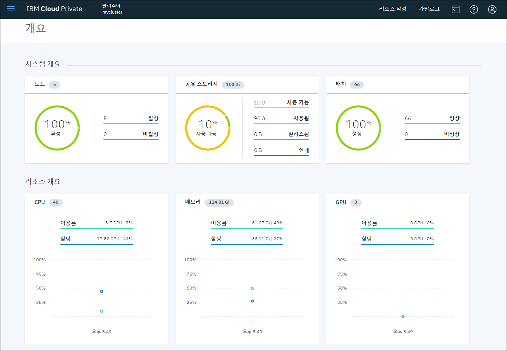

# POC 기능 점검 목록

## Application & Architecture

### 플랫폼 고가용성 구조

doc

### Application 고가용성 구조


### Network 분산

#### Service


#### Ingress


### Auto Healing


### 다양한 Workload 지원

```
- Deployment/ReplicaSet
- StatefulSet
- Job/CronJob
- DaemonSet
```

#### Deployment/ReplicaSet


#### StatefulSet


#### Job/CronJob


#### DaemonSet


### Scale In/Out


## Log

### Platform Log 범위

### Log Viewer (Kibana)


### Log Search

## Monitoring

### Platform Monitoring


### Application/Service Monitoring


### Alert I/F

### Alert Rule

## Platform Management

### ICP 설치 (CAM)


### ICP 운영관리 (MCM)


### Application Scheduling (MCM)

### 통합인증 (IAM)

#### 외부 LDAP 연동


#### 통합인증 제공


### 권한관리 (RBAC)

#### 사용자별 권한관리


#### 팀별 엑세스 자원 관리


### 용량관리

### Dashboard 지원

#### ICP 개요


#### Log


#### Monitoring


#### Alert


### Helm Chart 관리

#### local-chart Repository (upload)


#### mgmt-chart Repository (default)


## Docker Repository

### Registry Service


### Vulnerability Advisor


## Scalability

### OpenSource 지원

### MSA 지원

### Cloud Native 컴포넌트 호환

